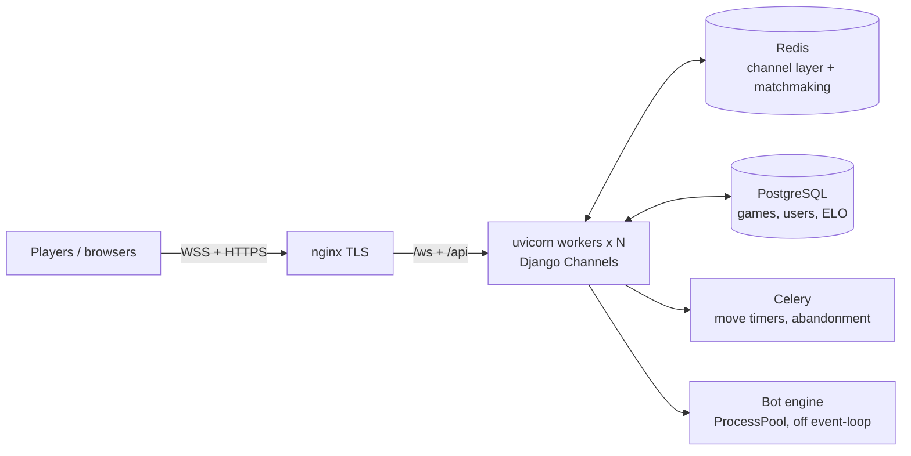

<div align="center">

# ♟️ Checkers — realtime Russian draughts (backend)

Online draughts you can play against a stranger, a friend, or a bot that won't
hand you the game. Django Channels over WebSockets, a search engine I wrote from
scratch, and enough load work that moves still land instantly with a couple
hundred games running at once.


<sub>Home — matchmaking, play vs bot, and a board that plays itself in the background</sub>

</div>

---

## What's in here

It's real-time, so most of the effort went into the parts you only notice under
load or on a flaky connection:

- **Three ways to play** over one WebSocket protocol: matchmaking, private
  friend links, and vs-bot. They share the same consumer mixins.
- **A bot engine I had to write myself** (`bot_ai/`). The draughts library ships
  one, but it's broken on the 8×8 Russian board, so this is negamax with
  alpha-beta, a bitboard evaluator, a transposition table, quiescence, and
  iterative deepening on a time budget. It runs in a process pool, off the event
  loop, so one slow search never freezes the other games. The harder levels
  actually punish a hung piece.
- **Matchmaking on a Redis sorted set**: rating window, atomic Lua claim,
  O(log N). No blocking `KEYS` scan.
- **The rest of what a real game needs**: ELO, a live eval bar for spectators,
  watcher counts, in-game chat, rematch, draw offers.
- **Connection handling that assumes the network will misbehave** — more on that
  at the bottom.
- Tests for the rules engine and the bot, plus WebSocket integration runners.

<div align="center">

<br><sub>Gameplay — smooth piece glide, live clocks, last-move arrows</sub>
</div>

## Performance

I load-tested through the real matchmaking flow — clients connect, get matched,
then play random legal moves — on a Docker box capped to a typical small VPS.

The headline is one number. Same game, move round-trip:

| | 1 process (naïve) | after the fixes |
|---|---|---|
| **p50 move latency** | **6,700 ms** | **17 ms** |
| CPU used (of 2 cores) | ~50% (one core, GIL-bound) | both cores |
| errors @ 300 games | 287 | ~1% |

Where it stays comfortable (moves feel instant, near-zero errors):

| Server | Concurrent games | Live sockets |
|---|---|---|
| 2 vCPU | ~100 | ~200 |
| 4 vCPU | ~200 | ~400 |
| 6 vCPU | ~350 | ~700 |

The bots here move with zero think time, which is the worst case; real people
take 3–10 seconds a move, so in practice that's thousands of concurrent users.
It scales roughly linearly with cores.

Three things got it there:
1. **Run multiple uvicorn workers.** One Python process is pinned to ~1 core by
   the GIL; N workers use every core and share state through Redis and Postgres.
2. **`thread_sensitive=False` on the DB path**, so a worker runs many queries at
   once instead of one at a time (that alone took p50 from 2,000 ms to 28 ms).
3. **Persistent DB connections**, and matchmaking on a ZSET instead of a `KEYS` scan.

## Architecture


## Stack
Python, Django 6, Channels (ASGI), uvicorn, Celery, PostgreSQL, Redis, Docker
Compose. Rules come from py-draughts; the search engine is mine.

## Run it
```bash
cp .env.example .env
docker compose up -d          # http://localhost:8000
# admin at /admin — testadmin / admin12345
```

## Deploy
It's all env-driven, so DevOps only edits `.env` and runs `docker compose up`.
Workers auto-scale to the host's CPUs, and migrations plus collectstatic run on
boot. One nginx terminates TLS and forwards the socket upgrade. Full guide in
**[`docs/deploy/DEPLOY.md`](docs/deploy/DEPLOY.md)**.

## A few problems worth remembering
- **The socket that never closes.** Kill your Wi-Fi and the TCP connection goes
  half-open; the browser may never fire `close`. A heartbeat notices the missed
  pong and starts reconnecting instead of waiting forever.
- **Clocks after a reconnect.** Your opponent kept moving while you were gone, so
  on every turn flip the clock re-syncs to the server's time rather than trusting
  whatever the client thinks.
- **The bottleneck wasn't load.** At 50% CPU and 7-second moves the box wasn't
  busy, it was serialized. Profiling — not guessing — pointed at the GIL, a
  single DB thread, and connection churn.

---
<div align="center"><sub>MIT</sub></div>
