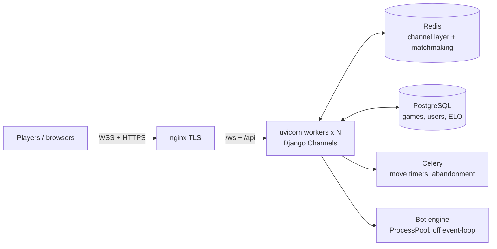

<div align="center">

# ♟️ Damka — realtime Russian checkers (backend)

**A production-grade multiplayer draughts backend** — online play, a from-scratch
bot engine, matchmaking, ELO, live spectating. Built to stay fast and correct
under load, not just to work in a demo.


<!-- GIFs recorded with ScreenToGif at localhost:3000. -->
<table>
  <tr>
    <td width="50%"></td>
    <td width="50%"></td>
  </tr>
  <tr>
    <td align="center"><sub>Gameplay — piece glide, live clocks, last-move arrows</sub></td>
    <td align="center"><sub>Home — live auto-playing board</sub></td>
  </tr>
</table>

*Two players, live clocks, move history, chat, rematch — all over WebSockets.*

</div>

---

## Table of contents
- [Highlights](#highlights)
- [Performance (measured)](#performance-measured)
- [Architecture](#architecture)
- [Tech stack](#tech-stack)
- [Run it locally](#run-it-locally)
- [Deploy](#deploy)
- [Engineering notes](#engineering-notes)

## Highlights
- **Realtime multiplayer** over WebSockets (Django Channels): online, vs-friend
  (private link), and vs-bot — one uniform event protocol, mixin-based consumers.
- **Custom bot engine** (`bot_ai/`) — negamax + alpha-beta, bitboard evaluation,
  transposition table, quiescence, iterative deepening with a time budget, run
  **off the event loop** in a process pool. Three difficulty levels. The library's
  built-in engine is broken on the 8×8 Russian board, so this is written from scratch.
- **Live eval bar** (chess.com-style) for spectators, streamed as a deepening search.
- **Matchmaking** on a Redis sorted set (rating window, atomic Lua claim) — O(log N),
  not a blocking keyspace scan.
- **ELO ratings**, observers with a live watcher count, in-game chat, rematch (MPTT tree).
- **Resilience worked out, not hand-waved:** heartbeat that detects a half-open
  socket (Wi-Fi off) instead of waiting on `onclose`, reconnect with clock re-sync,
  disconnect grace + abandonment policy, draw offer/decline.
- **Tests:** pytest suite for the rules engine and the bot; integration WS runners.

## Performance (measured)
Load-tested through the **real matchmaking flow** (players connect, match, then play
random legal moves) on Docker/Linux, capping the box to a "typical VPS".

**Headline:** the same game, move round-trip latency:

| | 1 process (naïve) | after the fixes |
|---|---|---|
| **p50 move latency** | **6,700 ms** | **17 ms** |
| CPU used (of 2 cores) | ~50% (one core, GIL-bound) | both cores |
| errors @ 300 games | 287 | ~1% |

**Comfortable capacity** (moves feel instant, ≈0 errors):

| Server | Concurrent games | Live sockets |
|---|---|---|
| 2 vCPU | ~100 | ~200 |
| 4 vCPU | ~200 | ~400 |
| 6 vCPU | ~350 | ~700 |

Bots move with *no* think time (worst case); real players think 3–10 s/move, so this
is **≈ thousands of real concurrent users**. Scaling is ~linear with cores.

The three fixes behind the numbers:
1. **Multi-worker ASGI** — one Python process is GIL-bound to ~1 core; N uvicorn
   workers (auto-scaled to CPUs) use them all, sharing state via Redis + Postgres.
2. **Concurrent DB** — `thread_sensitive=False` so each worker runs many ORM ops at
   once instead of one at a time (p50 2,000 ms → 28 ms).
3. **Persistent DB connections** + **ZSET matchmaking** (dropped a blocking `KEYS` scan).

## Architecture


## Tech stack
Python, Django 6, Django Channels (ASGI), uvicorn (multi-worker), Celery,
PostgreSQL, Redis, Docker Compose, py-draughts (rules) + a custom search engine,
pytest.

## Run it locally
```bash
cp .env.example .env
docker compose up -d          # http://localhost:8000
# admin at /admin — user "testadmin", password "admin12345"
```
and open two windows (one incognito) to matchmake against yourself, or play the bot.

## Deploy
Env-driven — DevOps edits only `.env`, then `docker compose up` (uvicorn workers
auto-scale to the server's CPUs; migrate + collectstatic run on start). One host
nginx terminates TLS and forwards the WebSocket upgrade. Full guide:
**[`docs/deploy/DEPLOY.md`](docs/deploy/DEPLOY.md)**.

## Engineering notes
The interesting problems weren't the CRUD — they were the realtime edge cases:
- **A dead socket that never fires `onclose`.** Turning off Wi-Fi leaves a half-open
  TCP connection; the browser may never emit `close`. A client heartbeat declares the
  link dead on a missed-pong timeout and drives reconnection.
- **Clock drift after reconnect.** While you're offline the opponent moves; on
  reconnect the clock re-syncs to the server's authoritative time on every turn flip.
- **A bot that hangs pieces.** Fixed by search depth + a blunder probability per level
  (and a transposition table so it reaches real depth in the budget), all off the
  event loop so one bot game never blocks the others.
- **Finding the real bottleneck.** At 50% CPU with 7-second latency the box wasn't
  busy — it was *serialized*. Profiling (not guessing) found the GIL, the single DB
  thread, and connection churn.

---
<div align="center"><sub>MIT licensed</sub></div>
